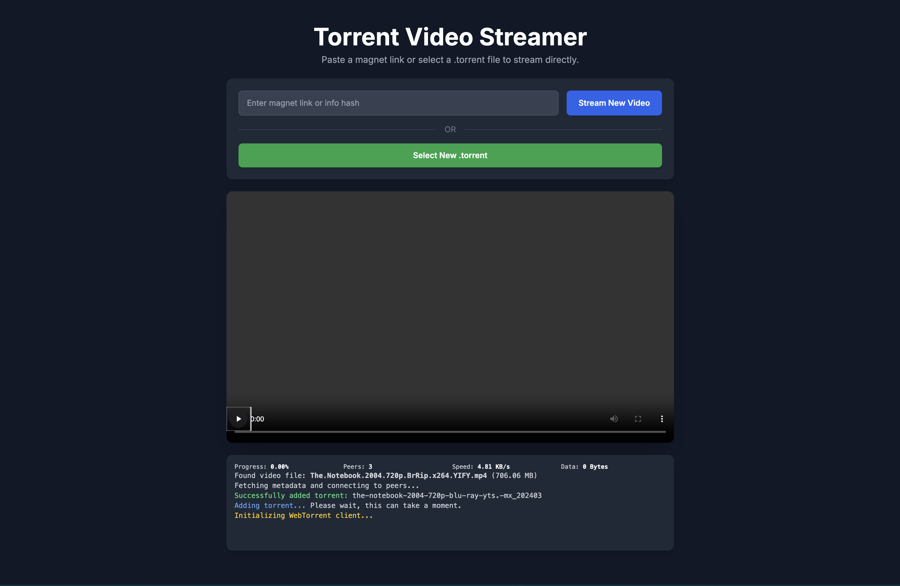

# Torrent in real time
<!-- Space for some badges... -->

Uses:

* Webtorrent
* HTML
* JS

> [!WARNING]
> This is not optimized for a comfortable usage, as it is extremely slow.  
> Intended as a learning tool, rather than for big use cases

Tested with "The Notebook" (2004) torrent from Internet Archive

Last updated -- 27.06.25
